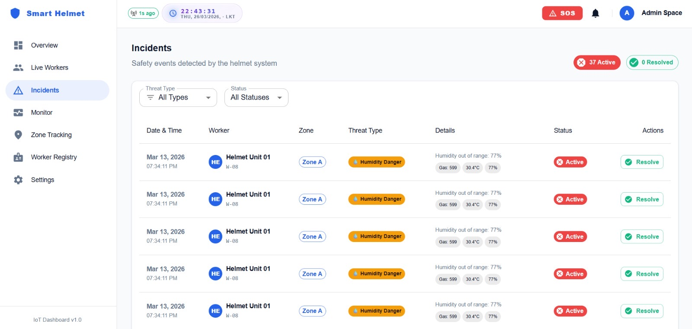

# 🪖 Smart Mining Helmet — IoT Safety Monitoring System

<div align="center">


**Real-time environmental monitoring, fall detection, RFID zone tracking, and emergency alert system for underground mine workers.**

[](LICENSE)
[]()
[]()

</div>

---

## 📌 Table of Contents
- [📖 Project Overview](#-project-overview)
- [✨ Key Features](#-key-features)
- [📸 Dashboard & System Screenshots](#-dashboard--system-screenshots)
- [🏗️ System Architecture & Data Flow](#%EF%B8%8F-system-architecture--data-flow)
- [⚡ Hardware Setup & Circuit Diagram](#-hardware-setup--circuit-diagram)
- [🛠️ Technology Stack](#%EF%B8%8F-technology-stack)
- [📁 Project Structure](#-project-structure)
- [🚀 Installation Guide](#-installation-guide)
- [📋 Usage & Operational Workflow](#-usage--operational-workflow)
- [⚠️ Risk Thresholds & Safety Rules](#%EF%B8%8F-risk-thresholds--safety-rules)
- [🔮 Future Improvements](#-future-improvements)
- [🤝 Contributing](#-contributing)
- [📄 License](#-license)
- [👨‍💻 Author](#-author)

---

## 📖 Project Overview

The **Smart Mining Helmet** is an advanced IoT-based wearable safety solution built to safeguard underground mine workers operating in hazardous environments. Mining shafts present severe life-threatening dangers, including sudden toxic gas leaks, extreme heat exposure, physical impacts, structural cave-ins, and disorientation.

This system combines dual **ESP32 microcontrollers**, environmental sensors, **RFID zone tracking**, and an **instant physical SOS button** with cloud sync. Telemetry data is broadcast every second to **Firebase Realtime Database** and visualised on a live, highly responsive **React + Material UI web dashboard**, empowering safety supervisors to remotely oversee worker conditions, receive automated instant alarms, and maintain comprehensive historical logs.

> 💡 *Mining environments account for hundreds of preventable fatalities annually. This smart helmet establishes a continuous digital safety barrier for every worker underground.*

---

## ✨ Key Features

| Feature | Description |
|---|---|
| 🔴 **Real-Time Gas Detection** | MQ-135 sensor continuously measures toxic gas levels (ADC 0–4095) with automatic warning/danger thresholds |
| 🌡️ **Temperature & Humidity Monitoring** | DHT11 sensor tracks ambient climate conditions to protect workers from heat stroke and dehydration |
| 🏃 **Fall & Impact Detection** | MPU6050 6-axis IMU detects severe physical shocks, trips, and free falls |
| 🆘 **Hardware Emergency SOS** | Dedicated physical helmet button triggers instant high-priority emergency alerts on the cloud dashboard |
| 📍 **RFID Zone Tracking** | Dual MFRC522 RFID readers log worker entry and exit across designated mine zones |
| 📡 **Live Cloud Dashboard** | 1-second live telemetry updates rendered via custom React hooks, interactive charts, and KPI widgets |
| 📊 **Historical Telemetry Analytics** | Keeps the last 100 environmental and motion telemetry records per worker for trend analysis |
| 🔔 **Automated Incident Logging** | Danger and warning events auto-create incident records stored in Firebase |
| 🔊 **Audio-Visual Helmet Alarms** | Active buzzer sound patterns and on-helmet 20×4 I2C LCD display provide instant feedback |
| 👷 **Worker Registry Management** | Supervisor panel to map RFID tag UIDs to worker identities and monitor active duty status |

---

## 📸 Dashboard & System Screenshots

Here is a visual walk-through of the Smart Mining Helmet safety dashboard and telemetry interfaces:

### 1. 🏠 Main Overview & Safety Dashboard
Provides safety supervisors with high-level KPI cards, total active worker counts, safety status distributions, and active alarms.


---

### 2. 👷 Live Worker Status & Monitoring
Displays real-time operational status, assigned helmets, current location zones, and safety indicators for all underground personnel.


---

### 3. 📊 Real-Time Sensor Telemetry & Analytics
Live-scrolling graphs for MQ-135 gas concentrations, DHT11 ambient temperature, and humidity readings updated every second.


---

### 4. 📍 RFID Worker Zone Tracking
Maps worker movements across underground sectors using dual RFID checkpoints, tracking entry/exit history and current zone presence.


---

### 5. ⚠️ Incident History & Safety Audit Log
Comprehensive log of all threshold violations, gas spikes, high temperatures, fall detections, and emergency alarms with exact timestamps.



---

### 6. 📝 Worker Registry & Cloud Management
Interface for safety administrators to register new workers, map RFID tags, update personal details, and assign safety equipment.


---

### 7. 🆘 Instant Emergency SOS Alert System
Immediate pop-up notification and high-visibility alert banner displayed when a worker triggers their helmet's physical SOS button.


---

## 🏗️ System Architecture & Data Flow

```
┌─────────────────────────────────────────────────────────────────────────────┐
│                            UNDERGROUND MINE                                 │
│                                                                             │
│  ┌───────────────────────────┐           ┌───────────────────────────────┐  │
│  │   Smart Helmet (ESP32 #1) │           │    Zone Tracker (ESP32 #2)    │  │
│  │   ─────────────────────── │           │    ───────────────────────    │  │
│  │   • MQ-135 Gas Sensor     │           │    • RFID Reader Zone A       │  │
│  │   • DHT11 Temp & Humidity │           │    • RFID Reader Zone B       │  │
│  │   • MPU6050 Accelerometer │           │    • 16×2 I2C LCD Status      │  │
│  │   • Physical SOS Button   │           └───────────────┬───────────────┘  │
│  │   • Active Buzzer + LCD   │                           │                  │
│  └─────────────┬─────────────┘                           │                  │
│                │                                         │                  │
│                └─────────────────┐     ┌─────────────────┘                  │
│                                  ▼     ▼                                    │
│                              WiFi / Network                                 │
└──────────────────────────────────┬──────────────────────────────────────────┘
                                   │ 1-Second Sync
                                   ▼
                   ┌───────────────────────────────┐
                   │   Firebase Realtime Database  │
                   │   ──────────────────────────  │
                   │   • /live/{workerId}          │
                   │   • /Telemetry/{workerId}     │
                   │   • /Workers/{workerId}       │
                   │   • /Incidents                │
                   │   • /ZonesHistory             │
                   │   • /SOS                      │
                   └───────────────┬───────────────┘
                                   │ Firebase Web SDK
                                   ▼
                   ┌───────────────────────────────┐
                   │      React Web Dashboard      │
                   │      (Vite + TypeScript)      │
                   │   • Live KPI Cards            │
                   │   • Sensor Charts (MUI X)     │
                   │   • RFID Zone Tracking Map    │
                   │   • Emergency SOS Alerts      │
                   └───────────────────────────────┘
```

---

## ⚡ Hardware Setup & Circuit Diagram

### 🔌 Project Circuit Diagram
Below is the hardware wiring diagram showing connections between the microcontrollers, sensors, RFID readers, displays, and alert peripherals:


---

### 📌 Helmet ESP32 Pin Mapping (Node #1)

| Sensor / Module | Function | ESP32 GPIO Pin |
|---|---|---|
| **DHT11** | Temperature & Humidity Data | GPIO 27 |
| **MQ-135** | Toxic Gas Analog Output | GPIO 34 (ADC1_CH6) |
| **MPU6050** | I2C Data (SDA) | GPIO 21 |
| **MPU6050** | I2C Clock (SCL) | GPIO 22 |
| **I2C LCD (20×4)** | Display SDA | GPIO 21 |
| **I2C LCD (20×4)** | Display SCL | GPIO 22 |
| **Active Buzzer** | Audio Alert Output | GPIO 25 |
| **SOS Button** | Emergency Pull-Down Button | GPIO 26 |

---

### 📌 Zone Tracker ESP32 Pin Mapping (Node #2)

| Module | Function | ESP32 GPIO Pin |
|---|---|---|
| **MFRC522 RFID #1** | Reader A Chip Select (SS) | GPIO 5 |
| **MFRC522 RFID #1** | Reader A Reset (RST) | GPIO 4 |
| **MFRC522 RFID #2** | Reader B Chip Select (SS) | GPIO 17 |
| **MFRC522 RFID #2** | Reader B Reset (RST) | GPIO 16 |
| **SPI Bus** | Clock (SCK) | GPIO 18 |
| **SPI Bus** | Master In Slave Out (MISO) | GPIO 19 |
| **SPI Bus** | Master Out Slave In (MOSI) | GPIO 23 |
| **I2C LCD (16×2)** | Display SDA | GPIO 21 |
| **I2C LCD (16×2)** | Display SCL | GPIO 22 |

---

## 🛠️ Technology Stack

### 🔹 Hardware Components
- **ESP32 Dev Module (x2)** — Dual-core Wi-Fi & Bluetooth microcontrollers
- **MQ-135 Air Quality Sensor** — Detects ammonia, sulfide, benzene steam, smoke, and hazardous gases
- **DHT11 Sensor** — Digital temperature and humidity module
- **MPU6050 6-Axis Accelerometer/Gyroscope** — Motion tracking and impact/fall detection
- **MFRC522 RFID Readers (x2)** — 13.56 MHz SPI contactless card readers for zone monitoring
- **20×4 & 16×2 I2C LCD Screens** — On-device visual output
- **Active Piezo Buzzer** — High-decibel audio warning system

### 🔹 Software & Firmware
- **Arduino C++** — Optimized firmware for ESP32 devices
- **Firebase ESP Client** — Direct HTTPS stream & RTDB SDK for ESP32
- **NTP Client** — Synchronized real-time UTC+5:30 timestamps via `pool.ntp.org`

### 🔹 Web Dashboard
- **React 18 + Vite** — High-performance frontend framework and build tool
- **TypeScript** — Strongly-typed code structure
- **Material UI (MUI v6)** — Modern design system and layout components
- **MUI X Charts** — Real-time telemetry visualization
- **Firebase Realtime Database SDK (v12)** — WebSockets pub/sub data binding

---

## 📁 Project Structure

```
IoT-Based-Mining-Worker-Safety-Helmet/
├── firmware/
│   ├── helmet_esp32/
│   │   └── helmet_esp32.ino        # Firmware for helmet node (Sensors + SOS + LCD)
│   └── Zone-Esp32/
│       └── zone-tracking_esp32.ino # Firmware for zone checkpoint node (Dual RFID)
│
├── mining-helmet-dashboard/        # React Web Application
│   ├── src/
│   │   ├── app/                    # Application shell, routing, layout wrapper
│   │   ├── components/             # Reusable UI widgets and navigation bars
│   │   ├── config/                 # Threshold constants & system configurations
│   │   ├── controllers/            # Custom Firebase React hooks & state managers
│   │   ├── models/                 # TypeScript interfaces and data types
│   │   ├── services/firebase/      # Firebase authentication & RTDB connections
│   │   ├── utils/                  # Formatters, date helpers, color mappers
│   │   └── views/                  # View pages
│   │       ├── Dashboard/          # Overview screen with safety KPIs
│   │       ├── Workers/            # Active worker cards and status
│   │       ├── WorkerDetails/      # Individual worker profile & timeline
│   │       ├── Monitor/            # Real-time scrolling telemetry charts
│   │       ├── Incidents/          # Safety audit log & incident history
│   │       ├── Zone/               # Live RFID zone monitoring map
│   │       ├── WorkerRegistry/     # Admin RFID card registration
│   │       └── Settings/           # Database credentials configuration
│   ├── public/                     # Static web assets
│   ├── index.html                  # HTML template
│   └── package.json                # Frontend dependencies & build scripts
│
├── Screenshots/                    # System interface reference screenshots
│   ├── Home scren.JPG
│   ├── Worker Scren.JPG
│   ├── Sensor Monitor .JPG
│   ├── Zone Tracking.JPG
│   ├── Incidents.JPG
│   ├── Worker Register Scren.JPG
│   └── SOS messagee.JPG
│
├── Project  circuit diagram.jpeg   # Hardware wiring diagram
└── README.md                       # Project documentation
```

---

## 🚀 Installation Guide

### 📋 Prerequisites
- **Node.js**: `v18.0.0` or higher
- **npm**: `v9.0.0` or higher
- **Arduino IDE**: `v2.0+` with ESP32 board support installed
- **Firebase Account**: Active Firebase project with Realtime Database and Auth enabled

---

### 💻 1. Web Dashboard Setup

```bash
# 1. Clone repository
git clone https://github.com/mr-kumuditha/IoT-Based-Mining-Worker-Safety-Helmet-with-RFID-Zone-Tracking-and-SOS-Alerts.git
cd IoT-Based-Mining-Worker-Safety-Helmet/mining-helmet-dashboard

# 2. Install dependencies
npm install

# 3. Launch local development server
npm run dev

# 4. Build for production deployment
npm run build
```

The web dashboard will be available at `http://localhost:5173`.

---

### 🔥 2. Firebase Configuration

Navigate to the **Settings** tab in the web dashboard or edit `src/services/firebase/rtdb.ts`:

```typescript
const firebaseConfig = {
  apiKey: "YOUR_FIREBASE_API_KEY",
  authDomain: "YOUR_PROJECT.firebaseapp.com",
  databaseURL: "https://YOUR_PROJECT-default-rtdb.firebaseio.com",
  projectId: "YOUR_PROJECT_ID",
  storageBucket: "YOUR_PROJECT.appspot.com",
  messagingSenderId: "YOUR_SENDER_ID",
  appId: "YOUR_APP_ID"
};
```

---

### ⚡ 3. ESP32 Firmware Upload

1. Open **Arduino IDE**.
2. Go to **Tools > Board** and select **ESP32 Dev Module**.
3. Install required libraries via **Library Manager**:
   - `Firebase ESP Client` by Mobizt
   - `MFRC522` by githubmodifi
   - `DHT sensor library` by Adafruit
   - `Adafruit MPU6050`
   - `LiquidCrystal I2C` by Frank de Brabander
4. Configure Wi-Fi SSID, Password, and Firebase DB credentials in the firmware files:
   - `firmware/helmet_esp32/helmet_esp32.ino`
   - `firmware/Zone-Esp32/zone-tracking_esp32.ino`
5. Connect your ESP32 board via USB and click **Upload**.

---

## 📋 Usage & Operational Workflow

1. **Power-up & Calibration**: When the Smart Helmet powers on, it connects to Wi-Fi, fetches NTP time, calibrates the MPU6050 accelerometer, and initializes sensor reads.
2. **Telemetry Broadcast**: Every **1 second**, gas, temperature, humidity, and motion vectors are published to `/live/{workerId}` in Firebase.
3. **Supervisor Overview**: Supervisors monitor live worker telemetry, gas safety status, and zone locations on the React Dashboard.
4. **Zone Scanning**: When a worker scans their RFID card at Zone Checkpoint A or B, the zone tracker updates `/Workers/{id}/currentZone` and logs a historical entry.
5. **Automated Alarm**: If gas exceeds **4000 ADC** or temperature surpasses **40°C**, the helmet buzzer sounds, the LCD alerts the worker, and an incident is automatically registered in Firebase.
6. **SOS Dispatch**: Pressing the helmet's physical SOS button immediately broadcasts an emergency notification to the dashboard with flashing alerts.

---

## ⚠️ Risk Thresholds & Safety Rules

| Parameter | Normal Range | Warning Level | Danger / Alarm Level |
|---|---|---|---|
| 💨 **Toxic Gas (ADC)** | `< 3000` | `3000 – 3999` | `≥ 4000` (Buzzer + Alert) |
| 🌡️ **Temperature (°C)** | `< 36°C` | `36°C – 40°C` | `> 40°C` (Extreme Heat) |
| 💧 **Humidity (%)** | `30% – 76%` | `< 30%` or `> 76%` | `< 20%` or `> 80%` |
| 🏃 **Physical Motion** | Normal Movement | Sudden Spike | **Fall Detected** (MPU6050 Shock) |
| 🆘 **SOS Switch** | Released | — | **Pressed** (Emergency Alert) |

---

## 🔮 Future Improvements

- [ ] **GPS Underground Positioning** — Integrate ultra-wideband (UWB) or GPS tracking for high-precision indoor mapping.
- [ ] **LoRaWAN / Mesh Network Support** — Enable long-range communication in deep mine shafts without Wi-Fi coverage.
- [ ] **Mobile App Notifications** — Push notifications via Firebase Cloud Messaging (FCM) to supervisor smartphones.
- [ ] **AI-Powered Fall Prediction** — Machine learning classification model for accelerometer data to differentiate true falls from routine tasks.
- [ ] **Biometric Monitoring** — Integrate pulse oximeter (MAX30102) to monitor heart rate and blood oxygen levels.
- [ ] **Battery Level Telemetry** — Monitor and display helmet battery percentage directly on the cloud dashboard.

---

## 🤝 Contributing

Contributions are greatly appreciated! If you'd like to improve the Smart Mining Helmet system:

1. **Fork** the Repository.
2. Create a Feature Branch (`git checkout -b feature/AmazingFeature`).
3. Commit your Changes (`git commit -m 'feat: Add AmazingFeature'`).
4. Push to the Branch (`git push origin feature/AmazingFeature`).
5. Open a **Pull Request**.

---

## 📄 License

Distributed under the **MIT License**. See [`LICENSE`](LICENSE) for more details.

---

## 👨‍💻 Author

**Kumuditha Tharinda**
- GitHub: [@mr-kumuditha](https://github.com/mr-kumuditha)
- Project Repository: [IoT-Based-Mining-Worker-Safety-Helmet](https://github.com/mr-kumuditha/IoT-Based-Mining-Worker-Safety-Helmet-with-RFID-Zone-Tracking-and-SOS-Alerts.git)

---

<div align="center">

⭐ **If you find this project useful, please star the repository!** ⭐

*Designed & developed for safer mining environments and worker protection.*

</div>
